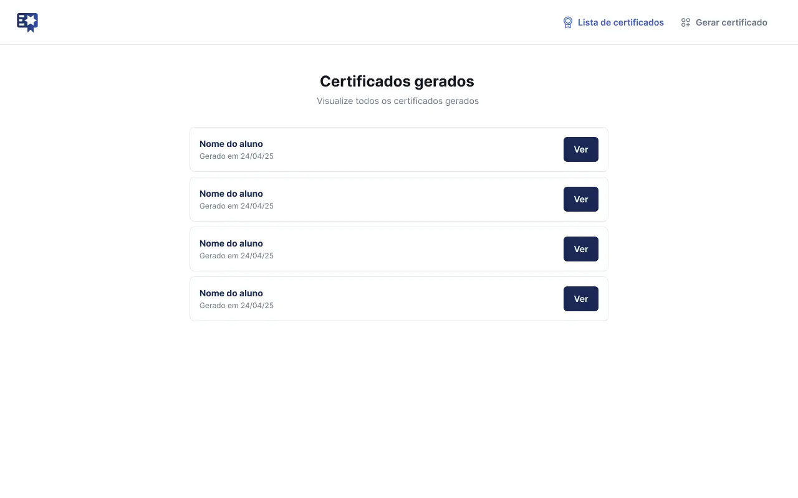

# 📜 Certificate Management

Uma plataforma moderna e elegante para gerenciamento completo de certificados, desenvolvida com as mais recentes tecnologias web.

## ✨ Funcionalidades

- **🔨 Criação de Certificados** - Design personalizado de certificados com templates modernos
- **📋 Listagem de Certificados** - Visualize todos os certificados em uma interface intuitiva
- **👁️ Visualização Detalhada** - Examine os certificados com zoom e detalhes completos
- **⬇️ Download de Certificados** - Exporte certificados em formato PDF ou imagem de alta qualidade

## 🚀 Tecnologias

Esta aplicação foi construída utilizando tecnologias de ponta:

- **Angular 20** - Framework front-end robusto e moderno
- **TypeScript 5.8** - Linguagem de programação tipada para desenvolvimento escalável
- **Tailwind CSS 4.1** - Framework CSS utilitário para design responsivo
- **Biome** - Ferramenta de linting para garantir qualidade de código
- **HTML-to-Image** - Biblioteca para converter HTML em imagens para download de certificados

## 🛠️ Instalação

Certifique-se de ter [Node.js](https://nodejs.org/) e [pnpm](https://pnpm.io/) instalados.
